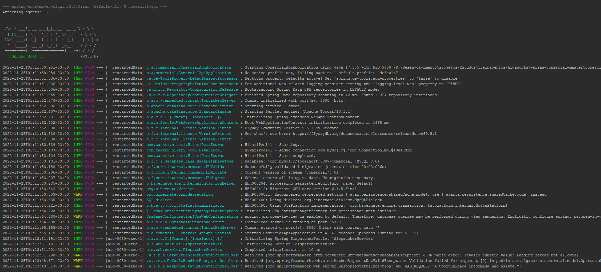

# Backend (Comercial Master)

Este projeto foi desenvolvido em Java 17 com Spring-Boot 3.0.0 e foi criado a partir do [Spring Initializr](https://start.spring.io/)



## Ferramentas utilizadas

* NetBeans 15 (com a extensão)
  * NB SpringBoot
* Postman (para testar os serviços REST da API)

## Dependências utilizadas

* Spring Boot DevTools
* Spring Data JPA
* Spring Web
* Flyway Migration
* MySQL Driver
* Validation

## Banco de Dados

### MySQL 8

Por meio do arquivo `application.properties` o banco de dados foi criado automaticamente com a ajuda do [Flyway](https://flywaydb.org/), as seguintes configurações foram adicionadas ao projeto:

```properties
spring.datasource.url=jdbc:mysql://localhost:3307/comercial?createDatabaseIfNotExist=true
spring.datasource.username=root
spring.datasource.password=
```

A tabela utilizada também foi criada com o auxilio do Flyway, utilizando o arquivo [V01__nova-tabela-oportunidade.sql](./src/main/resources/db/migration/V01__nova-tabela-oportunidade.sql) armazenado por padrão na pasta `/resources/db/migration`.
