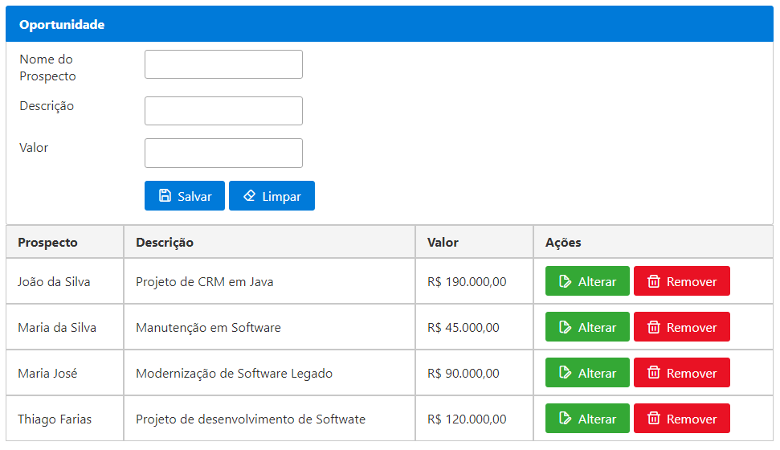

# Frontend (Comercial Master)

Este projeto foi desenvolvido em Angular 15 com [PrimeNG 15](https://www.primefaces.org/primeng/setup).

## Ferramentas utilizadas

* VS Code (com as estensões)
  * IntelliCode
  * ESLint
  * JSX HTML
  * Angular Language Service

## Dependências utilizadas

* PrimeNG
* PrimeIcons
* PrimeFlex

## Componentes utilizados

* Panel
* InputText
* Button
* DataTable
* Toast
